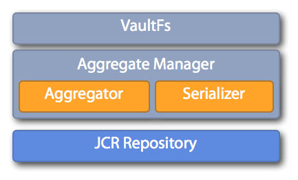
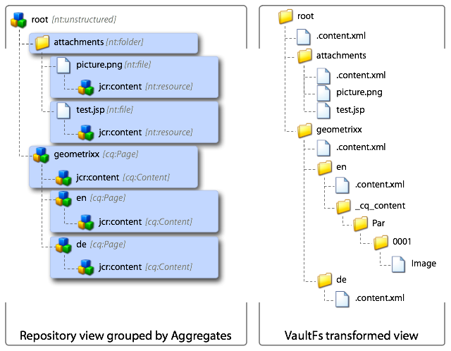

<!--
   Licensed to the Apache Software Foundation (ASF) under one or more
   contributor license agreements.  See the NOTICE file distributed with
   this work for additional information regarding copyright ownership.
   The ASF licenses this file to You under the Apache License, Version 2.0
   (the "License"); you may not use this file except in compliance with
   the License.  You may obtain a copy of the License at

       http://www.apache.org/licenses/LICENSE-2.0

   Unless required by applicable law or agreed to in writing, software
   distributed under the License is distributed on an "AS IS" BASIS,
   WITHOUT WARRANTIES OR CONDITIONS OF ANY KIND, either express or implied.
   See the License for the specific language governing permissions and
   limitations under the License.
-->

Vault FS
========

<!-- MACRO{toc} -->

Introduction
------------
We see in various applications the need for a simple JCR repository to filesystem mapping to be used in source management tools, fileserver bindings, import/export stuff etc. If a JCR repository would only consist of `nt:file` and `nt:folder`, this would be easy but if other nodetypes are used (even a simple as extending from `nt:file`) the mapping to the filesystem is not so trivial anymore. The idea is to provide a general all-purpose mechanism to export to and import from a standard (java.io based) filesystem.

The *VaultFs* is designed to provide a general filesystem abstraction of a JCR repository. It provides the following features:

- **intuitive mapping**: A `nt:file` should just map to a simple file, a `nt:folder` to a directory. More complex node types should map to a `nodename.xml` and a possible `nodename` folder that contains the child nodes or be aggregated to a complete or partial serialization.
- **universal API**: the API should be suitable for all filesystem based applications like WebDAV, CIFS, SCM Integration, FileVault, etc.
- **extendable**: A plugin mechanism should allow to extend the mapping layer for further conversions filters and aggregators.

Overview
--------


VaultFs consists mainly of 2 layers that map the repository's nodes to VaultFs files: The _Aggregate Node Tree_ that is managed by the _aggregate manager_ represents a hierarchical view of the content aggregates. Each aggregate is addressed by a path and allows access to its artifacts. The artifacts nodes are built using _aggregators_ that define which repository items belong to an aggregate and what artifacts they produce. For each artifact there is a _serializer_ defined that is used to export and import the respective content. 

On top of the aggregate tree is the _Vault File System_ that accesses the aggregates and exposes them as tree of _vault files_. They can be used to export and import the actual repository content. The mapping from aggregates and its artifacts to vault files is done in an intuitive way so that clients (and users) can deal with them in a natural filesystem like fashion.



Aggregate Manager
-----------------
The aggregate manager is configured with a set of aggregators and serializers. Its configuration can be overridden in [`META-INF/vault/config.xml` of content packages](config.html). Once the manager is mounted on a jcr repository it exposes a tree of aggregates. They are collected using an aggregator that matches the respective repository node. For example the _nt:file aggregator_ produces an artifacts node that allows no further child nodes and provides (usually) one primary artifact (which represents the content of the file).


### Artifacts
An artifact is one aspect or part of a content aggregation. The following artifact types exist:

- **Directory Artifacts**: represent the folder aspect of an aggregate. For example a pure `nt:folder` would produce an aggregate with just one sole directory artifact.
- **File Artifacts**: represent file aggregates. since the `nt:file` handling is very special there is an special type for it.
- **Primary Artifacts**: represent the main aggregate. This usually contains all nodes and properties that belong to the aggregate that cannot be expressed by another type.
- **Binary Artifacts**: represent binary content that is not included in the primary or file artifacts. This is for example suitable for binary properties that were not included in a xml deserialization. This allows keeping the deserializations leaner and more efficient.

Content Aggregation
-------------------
A subtree of nodes will be aggregated semantically into one entity, the aggregate. This mainly consists of a path and a set of artifacts and may have child aggregates.

the mechanism how content aggregation works is defined by a set of _filters_ with corresponding _aggregators_. if we look at the export in a recursive way, it would work as follows:

1. traverse the repository starting at the root node
2. for each node check which filter matches
3. execute the respective aggregator and create a new aggregate
4. if aggregator allows child nodes descend into the excluded nodes

### Aggregates
An aggregate is a tree of repository items that belong together and are mapped to (a set of) artifacts. The artifacts represent filesystem resources. The aggregate type is defined by the aggregator type and not primarily by the content, i.e. the selected aggregator must return stable coverage information which is not dependent of the actual content.

There are mainly 4 types of aggregates:

#### Full coverage aggregates
Full coverage aggregates aggregate an entire subtree. For example the complete serialization of a `nt:nodeType` node or a _dialog definition_. They are very simple to deal with, since the root node of the aggregate is usually serialized into 1 filesystem file.

The following repository structure:

```
    + nodetypes [nt:unstructured]
      + nt1 [nt:nodeType]
        + jcr:propertyDefinition [nt:propertyDefinition]
        + jcr:propertyDefinition [nt:propertyDefinition]
        + jcr:childNodeDefinition [nt:childNodeDefinition]
      + nt2 [nt:nodeType]
        ...
```

could be mapped to:

```
    `- nodetypes
       |- nt1.cnd
       `- nt2.cnd
```

#### Generic aggregates
Generic aggregates cover a part of a content subtree, hence they have not a full coverage. They always consist at least of a primary artifact and a directory artifact. Examples of those are the aggregation of a `cq:Page` structure or of `nt:unstructured` nodes. 

the following repository structure:

```
    + en [cq:Page]
      + jcr:content [cq:Content]
      + about [cq:Page]
        + jcr:content [cq:Content]
          + header [cq:Content]
            + image.jpg
      + solutions [cq:Page
        + jcr:content [cq:Content]
```

are mapped to:

```
    - `en
       |- .content.xml
       |- about
       |  |- _jcr_content
       |  |  `- header
       |  |     `- image.jpg
       |  `- .content.xml
       `- solution
          `- .content.xml
```

the example above just excluded some direct child nodes of the aggregate root from the aggregation (with the exception of the `image.jpg` node). but this could be more complicated.

overlapping example:

```
    + apps [nt:unstructured]
      + example [nt:unstructured]
        + components [nt:unstructured]
          + image [cq:Component]
            + dialog [cq:Dialog]
              ...  
            + default.jsp [nt:file] 
```

is be mapped to:

```
    `- apps
       |- .content.xml
       `- example
          |- .content.xml
          `- components
            |- .content.xml
             `- image
                |- .content.xml
                |- dialog.xml
                `- default.jsp
```

This example has 6 aggregates:

 1. the generic aggregate for `apps`
 2. the generic aggregate for `example`
 3. the generic aggregate for `components`
 4. the generic aggregate for `image`
 5. the `default.jsp` file aggregate
 6. the `dialog.xml` full coverage aggregate

#### Simple File aggregates
Since files (`nt:file` nodes and extents) are common they are treated differently in aggregation. The simplest mapping is to create a filesystem file for each `nt:file`. Unfortunately there is some information in a default `nt:file` that cannot be preserved in the filesystem, namely:

* `jcr:created` property
* `jcr:content/jcr:uuid` property
* `jcr:content/jcr:encoding` property
* `jcr:content/jcr:mimeType` property

So in order to achieve a complete serialization there is an extra artifact needed to store this info.
To still keep the mapping lean, those properties are not part of the file aggregate but 'delegated' to its parent aggregate.

example:

```
    + foo [nt:folder]
      + example.jsp [nt:file]
        - jcr:created ...
        + jcr:content [nt:resource]
          - jcr:data
          - jcr:lastModified
          - jcr:mimeType
```

is mapped to:

    `- foo
       |- .content.xml
       `- example.jsp

the `.content.xml` will include the properties that are not handled by the `example.jsp`

#### Extended File aggregates
When `nt:file` nodes are extended, either by primary or mixin type, the primary artifact remains the generic serialization of the resource. Additional information needs to be serialized to an extra artifact.

Example:

    + sample.jpg [dam:file]
      - jcr:created
      + jcr:content [dam:resource]
        - jcr:lastModified
        + dam:thumbnails [nt:folder]
          - 90.jpg [nt:file]
          - 120.jpg [nt:file]

are be mapped to:

    |- sample.jpg
    `- sample.jpg.dir
       |- .content.xml
       `- _jcr_content
          `- _dam_thumbnails
             |- 90.jpg
             `- 120.jpg

#### Folder aggregates
pure `nt:folder` aggregates will result in one directory and mostly in an additional `.content.xml`

#### Binary Properties
There is some special handling for binary properties other than `jcr:data` in a `jcr:content` node. 
Example (although this is probably very rare):

    + foo [nt:unstructured]
      + bar [nt:unstructured]
        + 0001 [nt:unstructured]
          - data1 (binary)
          - data2 (binary)
        + 0002 [nt:unstructured]
          - data1 (binary)
          - data2 (binary)

is mapped to:

```
    `- foo
       |- .content.xml
       `- bar
          |- 0001
          |  |- data1.binary
          |  `- data2.binary
          `- 0002
             |- data1.binary
             `- data2.binary
```

Multi-value binary properties are mapped to multiple files named `<property name>[<0-based index>].binary`

#### Resource Nodes
There are some cases where `nt:resource` like structures are used that are not held below a `nt:file` node.

```
    + foo [nt:unstructured]
      + cq:content [nt:resource]
        - jcr:mimeType "image/jpg"
        - jcr:data  
        - jcr:lastModified
```

This is mapped to:

```
    `- foo
       |- .content.xml
       `- _cq_content.jpg
```

where the mime type and modification date can be recorded in the primary artifact. Possible other properties like `jcr:uuid` etc would go to the parent aggregate.

#### Filename escaping

Not all of the allowed characters in a jcr name are allowed filesystem characters and need escaping. The normal case is to use the _url encoding_, i.e. using a `%` followed by the hexnumber of the character. But this look ugly, especially for the colon `:`, eg a `cq:content` would become `cq%3acontent`. So for the namespace prefix there is a special escaping by replacing it by a underscores, eg: `cq:content` will be `_cq_content`. Node names already containing two underscores need to be escaped using a double underscore. eg: `_test_image.jpg` would become `__test_image.jpg`.

more examples:

| node name | file name |
| --- | --- |
| `test.jpg` | `test.jpg` |
| `cq:content` | `_cq_content` |
| `test_image.jpg` | `test_image.jpg` 
| `_testimage.jpg` | `_testimage.jpg` |
| `_test_image.jpg` | `__test_image.jpg` |
| `cq:test:image.jpg` | `_cq_test%3aimage.jpg` <sup>1</sup> |

<sup>1</sup> this is a very rare case and justifies the ugly `%3a` escaping.

Serialization
-------------
The serialization of the artifacts is defined by the **serializer** that is provided by the aggregator. Currently there are only 2 kind of serializations used: 

1. a direct data serialization for the contents of file or binary artifacts and 
2. an enhanced _docview_ serialization for the rest. The [_enhanced docview_ serialization][enhanceddocview] that is used allows multi-value properties and explicit types in contrast to regular [document view XML defined by JCR 2.0][docview].

Deserialization
---------------
Although for exporting only 2 serialization types are used this is a bit different for importing. The importer analyzes the provided input sources and determines the following serialization types:

* generic XML
* (enhanced) docview XML
* sysview XML, as defined in [JCR 2.0][sysview]
* generic data

Depending on the configuration those input sources can be handled differently. Currently they are imported as follows:

**generic XML** produces a `nt:file` having a `jcr:content` of the deserialization of the xml document.

**docview XML** is more or less imported directly below the respective import root.

**sysview XML** is more or less imported directly below the respective import root.

**generic data** produces a `nt:file` having the data as `nt:resource` content.


Terminology
-----------

*VaultFs*: The File Vault Filesystem. Provides file-like abstraction of a JCR repository.

*VaultFile*: A VaultFs entity that represents a file-like abstraction of a (partial) repository node tree.

*Aggregate*: Represents an addressable collection of artifacts.

*Aggregator*: Interface that defines the methods for building content aggregates.

*Serializer*: Interface that defines the methods for serializing an artifact. 
 
*Artifact handler*: Interface that defines methods for deserializing artifacts.

*Artifact*: Representation of a content aggregate. An aggregator can provide several artifacts. 
  An artifact is either mapped to a file or a directory and can be of the 
  type: **primary**, **file**, **binary** or **directory**

[enhanceddocview]: docview.html
[docview]: https://s.apache.org/jcr-2.0-spec/7_Export.html#7.3%20Document%20View
[sysview]: https://s.apache.org/jcr-2.0-spec/7_Export.html#7.2%20System%20View